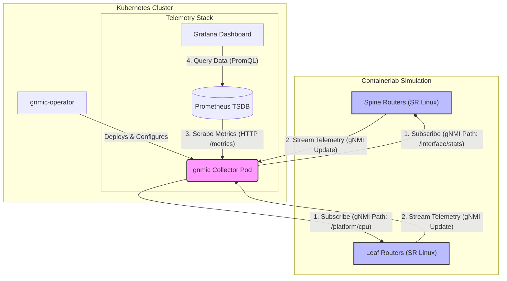

# 🚀 Model-Driven Telemetry with gnmic-operator & SR Linux

A complete, Cloud-Native observability stack for network devices running on Kubernetes. This repository deploys a simulated **Nokia SR Linux** fabric using [Containerlab](https://containerlab.dev/) and monitors it using the [gnmic-operator](https://operator.gnmic.dev/docs/) to stream gNMI telemetry into **Prometheus** and **Grafana**.

## 🏗️ Architecture

* **Fabric:** 2x Spines, 3x Leafs (Nokia SR Linux)
* **Collector:** `gnmic` (deployed via Kubernetes Operator)
* **Database:** Prometheus
* **Visualization:** Grafana
* **Infrastructure:** Kind / K3s / Orbstack (Kubernetes)

### How it Works

The following diagram illustrates the data flow from the simulated network fabric to the visualization layer.



## 📂 Repository Structure

```text
.
├── README.md               # This file
├── dashboard.json          # Ready-to-use Grafana Dashboard Model
└── YAML/
    ├── targets.yaml        # gnmic Target & Secret CRDs
    ├── subscriptions.yaml  # Subscription CRDs (Interfaces, CPU, Environment)
    ├── output.yaml         # Pipeline & Output CRDs
    └── service-fix.yaml    # ServiceMonitor fix for port translation

```

## 📋 Prerequisites

* Docker
* Kubernetes Cluster (Kind, K3s, or Orbstack)
* `kubectl`
* `containerlab`
* `helm`

## 🚀 Quick Start

### 1. Deploy the Lab

Spin up the simulated fabric using the topology file in the `YAML` folder.

```bash
sudo containerlab deploy -t YAML/topology.clab.yml

```

### 2. Install the Stack

Deploy the `gnmic-operator` and the `kube-prometheus-stack` (Prometheus + Grafana).

```bash
# Add Helm Repos
helm repo add gnmic https://gnmic.openconfig.net/helm-charts
helm repo add prometheus-community https://prometheus-community.github.io/helm-charts
helm repo update

# Install Operators
helm install gnmic-operator gnmic/gnmic-operator
helm install prometheus prometheus-community/kube-prometheus-stack

```

### 3. Apply Telemetry Configuration

Deploy the custom resources (CRDs) that define *what* to collect and *how*.

```bash
# 1. Define the Targets (Routers)
kubectl apply -f YAML/targets.yaml

# 2. Define Subscriptions (Interfaces & CPU)
kubectl apply -f YAML/subscriptions.yaml

# 3. Deploy the Collector Pipeline
kubectl apply -f YAML/output.yaml

```

*(Note: If Prometheus targets show "Connection Refused" due to the operator port bug, apply the service fix included).*

```bash
kubectl apply -f YAML/service-fix.yaml

```

### 4. Visualize Data 📊

Access the dashboards.

* **Prometheus:** `http://localhost:9090`
* **Grafana:** `http://localhost:8080` (Default login: `admin` / `prom-operator`)

**Import the Dashboard:**

1. Open Grafana.
2. Go to **Dashboards -> Import**.
3. Upload `YAML/dashboard.json` from this repo.

## 🐛 Troubleshooting

**Targets are DOWN in Prometheus?**
Check the service port mapping. The operator sometimes randomizes the backend port but hardcodes the Service port.

```bash
kubectl get svc -n default

```

If the port doesn't match `9804` (or whatever the operator assigned), the `YAML/service-fix.yaml` file forces a direct mapping to the pod's real port.

**No Data in Grafana?**
Check the `gnmic` logs for gNMI path errors:

```bash
kubectl logs -l operator.gnmic.dev/cluster=telemetry-cluster

```

## 📜 License

MIT