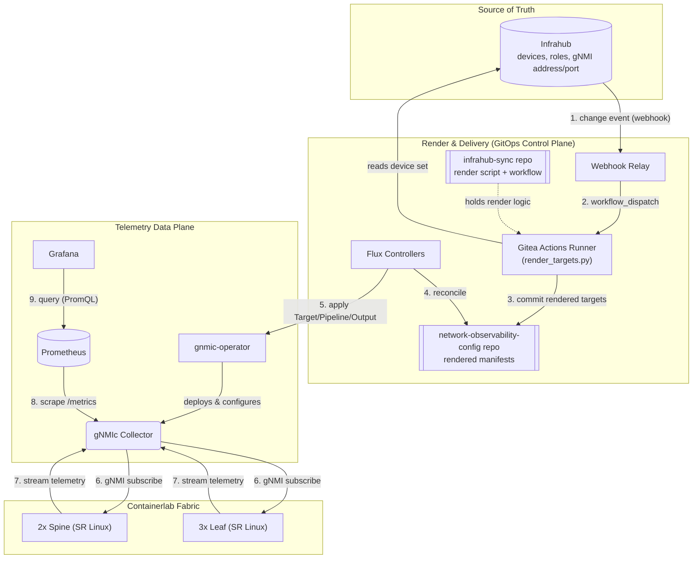

# 🌐 Network Observability, Driven by a Source of Truth

A fully automated, GitOps-driven telemetry platform for network devices. **Infrahub** is the single source of truth; changes made there flow automatically through CI, Git, and Flux into a live **gNMIc → Prometheus → Grafana** monitoring stack running on Kubernetes.

Add a device in Infrahub and it starts being monitored. Delete it and it disappears from the entire system. You never hand-edit a manifest.

---

## ✨ What This System Does

- **Models the network in Infrahub** — devices, roles, platforms, interfaces, links, and per-device gNMI reachability (address + port) live as structured, validated data.
- **Renders telemetry config automatically** — a CI workflow reads the current device set from Infrahub and generates gNMIc `Target` manifests. No manual YAML.
- **Delivers via GitOps** — rendered manifests are committed to a Git repo that **Flux** continuously reconciles into the cluster.
- **Collects and visualizes** — the **gnmic-operator** streams gNMI telemetry from the SR Linux fabric into **Prometheus**, visualized in **Grafana**.
- **Event-driven** — a change in Infrahub fires a webhook that triggers the render pipeline within seconds, via a lightweight relay.
- **Cascade-safe deletes** — removing a device in Infrahub cascades to its interfaces and links, and the removal propagates all the way to the cluster.
- **Reproducible from one command** — the entire stack stands up with `make deploy` and tears down with `make clean`.

---

## 🏗️ Architecture

The system has two planes: a **control plane** (source of truth → render → GitOps) that decides *what* should be monitored, and a **data plane** (collector → TSDB → dashboards) that does the monitoring.


```mermaid
graph TD
    subgraph SoT["Source of Truth"]
        Infrahub[("Infrahub<br/>devices, roles, gNMI address/port")]
    end

    subgraph CI["Render & Delivery (GitOps Control Plane)"]
        Relay["Webhook Relay"]
        Runner["Gitea Actions Runner<br/>(render_targets.py)"]
        SyncRepo[["infrahub-sync repo<br/>render script + workflow"]]
        FluxRepo[["network-observability-config repo<br/>rendered manifests"]]
        Flux["Flux Controllers"]
    end

    subgraph Data["Telemetry Data Plane"]
        Operator["gnmic-operator"]
        Collector("gNMIc Collector")
        Prometheus[("Prometheus")]
        Grafana["Grafana"]
    end

    subgraph Fabric["Containerlab Fabric"]
        Spines["2x Spine (SR Linux)"]
        Leafs["3x Leaf (SR Linux)"]
    end

    Infrahub --"1. change event (webhook)"--> Relay
    Relay --"2. workflow_dispatch"--> Runner
    Runner --"reads device set"--> Infrahub
    Runner --"3. commit rendered targets"--> FluxRepo
    SyncRepo -.holds render logic.-> Runner
    Flux --"4. reconcile"--> FluxRepo
    Flux --"5. apply Target/Pipeline/Output"--> Operator
    Operator --"deploys & configures"--> Collector
    Collector --"6. gNMI subscribe"--> Spines
    Collector --"6. gNMI subscribe"--> Leafs
    Spines --"7. stream telemetry"--> Collector
    Leafs --"7. stream telemetry"--> Collector
    Prometheus --"8. scrape /metrics"--> Collector
    Grafana --"9. query (PromQL)"--> Prometheus
```

### The Flow, End to End

1. You add, change, or delete a device in **Infrahub**.
2. Infrahub fires a **webhook** to the **relay**, which translates it into a Gitea `workflow_dispatch` call.
3. The **Gitea Actions runner** runs `render_targets.py`, which queries Infrahub for the full device set and renders the complete gNMIc target list.
4. The workflow **commits** the rendered manifests to the `network-observability-config` repo.
5. **Flux** detects the commit and applies the manifests to the cluster.
6. The **gnmic-operator** reconciles `Target`, `Subscription`, `Output`, and `Pipeline` resources; the **collector** subscribes to each device over gNMI.
7. Telemetry streams into the collector, is exposed as Prometheus metrics, and is visualized in Grafana.

Because the render is **declarative** — it always rewrites the entire target set from Infrahub's current state — additions, changes, and deletions all propagate the same way. Infrahub is authoritative by construction.

---

## 🧩 Components

| Component | Role | Namespace |
|---|---|---|
| **Infrahub** | Source of truth (devices, roles, platforms, interfaces, gNMI address/port) | `infrahub` |
| **Gitea** | Git server hosting both repos, plus Actions CI runner | `gitea` |
| **Webhook Relay** | Translates Infrahub events into Gitea workflow dispatches | `infrahub-relay` |
| **Flux** | GitOps reconciler applying rendered manifests | `flux-system` |
| **gnmic-operator** | Manages gNMIc collector clusters and telemetry CRDs | `gnmic-operator` |
| **gNMIc Collector** | Subscribes to devices, exports Prometheus metrics | `default` |
| **Prometheus + Grafana** | Metrics storage and visualization (kube-prometheus-stack) | `monitoring` |
| **cert-manager** | Certificate management for the operator | `cert-manager` |
| **Containerlab fabric** | 2 spines + 3 leafs of Nokia SR Linux | (host) |

### The Two Repositories

- **`infrahub-sync`** — holds the render logic: `render_targets.py` and the `.gitea/workflows/sync-targets.yaml` CI workflow. This is *how* targets are generated.
- **`network-observability-config`** — holds the manifests Flux watches: the static telemetry config (cluster, output, pipeline, subscriptions, monitoring, credentials) plus the **generated** `02-targets.yaml`. This is *what* runs in the cluster.

The boundary between "human-managed" and "machine-generated" is a file boundary: only `02-targets.yaml` is rewritten by CI; everything else is authored by hand and never clobbered.

---

## 📋 Prerequisites

- Docker
- A Kubernetes cluster (Kind, K3s, or OrbStack)
- `kubectl`, `helm`, `flux`
- `containerlab`
- Python 3 with `infrahub-sdk` and `pyyaml` (`pip install infrahub-sdk pyyaml`)
- `infrahubctl` (`pip install infrahub-sdk`)

---

## 🚀 Quick Start

### 1. Bring up the network fabric

```bash
sudo containerlab deploy -t YAML/st.clab.yml
```

### 2. Deploy the entire platform

```bash
make deploy
```

This single command:
- installs Gitea and creates both repositories,
- deploys the CI runner,
- installs cert-manager, the gnmic-operator, and the Prometheus stack,
- installs Infrahub and loads the topology schema,
- syncs the containerlab topology into Infrahub (devices, interfaces, links, gNMI address/port),
- pushes the render logic and initial manifests into Git and sets CI secrets,
- installs Flux and points it at the config repo,
- deploys the webhook relay and wires the Infrahub → relay → CI event loop.

When it finishes, telemetry is flowing.

### 3. Check health

```bash
make status
```

---

## 🎮 Using the System

The core idea: **you only ever change Infrahub.** Everything downstream follows.

### Add a device

Create a `TopologyDevice` in Infrahub (UI or SDK) with a name, role, platform, and its `gnmi_address` / `gnmi_port`. The webhook triggers a render, Flux applies the new target, and the collector starts subscribing. To re-import the whole containerlab topology instead:

```bash
make sync-topology
```

### Change where a device is reached

Edit the device's `gnmi_address` or `gnmi_port` in Infrahub. On the next sync, the rendered `Target` updates and gNMIc re-dials the new address. Reachability is data, not hardcoded config.

### Delete a device

Delete the `TopologyDevice` in Infrahub. Its **interfaces and links cascade-delete automatically** (the schema models interfaces as components of the device). The render then omits the device, Flux prunes its `Target`, and the collector drops the subscription.

### Manually trigger a sync

Useful for testing without changing data:

```bash
make test-sync
```

### Tear it all down

```bash
make clean
```

---

## 🔌 Accessing the Services

All services run inside the cluster. Use `kubectl port-forward` to reach them from your machine. Run each in its own terminal (or background with `&`).

> **Tip:** if a local port is already in use, change the left-hand number (e.g. `3001:3000`). To clear stale forwards: `pkill -f "kubectl port-forward"`.

### Infrahub (source of truth)

```bash
kubectl port-forward svc/infrahub-infrahub-server 8000:8000 -n infrahub
```
Open **http://localhost:8000**. Get the admin token:
```bash
POD=$(kubectl get pod -l infrahub/service=server -n infrahub -o jsonpath="{.items[0].metadata.name}")
kubectl exec -n infrahub $POD -- printenv INFRAHUB_INITIAL_ADMIN_TOKEN
```

### Gitea (Git + CI)

```bash
kubectl port-forward svc/gitea-http 3000:3000 -n gitea
```
Open **http://localhost:3000** — login `admin` / `password123`. The **Actions** tab of the `infrahub-sync` repo shows render/commit runs.

### Grafana (dashboards)

The Grafana that ships with the kube-prometheus-stack runs in the `monitoring` namespace behind a Service on port 80. Forward it to a local port (using `3001` to avoid colliding with Gitea on `3000`):

```bash
kubectl port-forward svc/prometheus-grafana 3001:80 -n monitoring
```

Then open **http://localhost:3001**.

The admin username is `admin`. The password is auto-generated and stored in a Kubernetes secret — retrieve it with:

```bash
kubectl get secret prometheus-grafana -n monitoring \
  -o jsonpath="{.data.admin-password}" | base64 -d ; echo
```

Log in as `admin` with that password, then import the bundled dashboard via **Dashboards → Import** and upload `dashboard.json`.

> **Note on the containerlab Grafana:** the containerlab topology also defines its *own* Grafana node (at `172.80.80.43:3000`, anonymous admin enabled) with pre-provisioned dashboards from `configs/grafana`. That is a **separate** instance from the Kubernetes one above. The K8s Grafana queries the in-cluster Prometheus that scrapes gNMIc; use it for the GitOps-driven telemetry. The containerlab one is only reachable if you expose that lab node's port.

#### Grafana access — troubleshooting

**The password command returns nothing / the login fails.**
The `| base64 -d ; echo` matters — the secret is base64-encoded, and the trailing `echo` adds the newline so you can see and copy the full value. Without `-d` you'll copy the encoded string and the login will silently fail.

**`port-forward` fails with `address already in use`.**
A previous forward is still holding the local port. This happens often when a forward was backgrounded and not cleaned up. Clear all of them and retry:
```bash
pkill -f "kubectl port-forward"
```
Or just pick a different local port: `kubectl port-forward svc/prometheus-grafana 3002:80 -n monitoring`.

**Copy-pasting multi-line commands into zsh mangles them.**
Pasting a block that contains `#` comment lines or a `?` in a URL can make zsh throw `command not found: #` or `no matches found`, and the real command may run against a half-ready port-forward — producing misleading results (e.g. an empty query result even though data exists). Run the port-forward and the query as **separate** commands, and quote any URL containing `?`:
```bash
# start the forward first, in its own terminal or backgrounded:
kubectl port-forward svc/prometheus-operated 9090:9090 -n monitoring &
# then run the query as a single quoted line, no inline comments:
curl -s 'http://localhost:9090/api/v1/query?query=up' | python3 -m json.tool
```

**Grafana loads but panels are empty.**
The data itself lives in Prometheus, not Grafana — confirm Prometheus actually has the metrics first (see the Prometheus section below). If Prometheus has data but Grafana panels are blank, check that Grafana's Prometheus datasource points at the in-cluster Prometheus and that the dashboard's queries match the `gnmic_`-prefixed metric names.


### Prometheus (metrics / query)

```bash
kubectl port-forward svc/prometheus-operated 9090:9090 -n monitoring
```
Open **http://localhost:9090**. Check **Status → Targets** for the gNMIc scrape target, or query directly:
```bash
curl -s 'http://localhost:9090/api/v1/query?query=gnmic_srl_nokia_interfaces_interface_oper_state' \
  | python3 -c "import sys,json; print('series:', len(json.load(sys.stdin)['data']['result']))"
```

### gNMIc collector (raw metrics endpoint)

```bash
kubectl exec -n default gnmic-telemetry-cluster-0 -- wget -qO- localhost:10124/metrics | head
```

---

## 🔍 Verifying It Works

```bash
# Targets applied by Flux, sourced from Infrahub:
kubectl get targets -n default

# Flux reconciliation status:
flux get kustomizations

# Collector connected to all devices:
kubectl logs -n default -l operator.gnmic.dev/cluster=telemetry-cluster \
  | grep "capabilities request successful"

# Force a Flux sync after a commit:
flux reconcile kustomization observability-sync --with-source
```

---

## 🐛 Troubleshooting

**A change in Infrahub didn't propagate.**
Check the relay received the event and dispatched:
```bash
kubectl logs -n infrahub-relay deploy/infrahub-relay
```
Then check the run in the `infrahub-sync` Actions tab. To bypass the webhook and test render+commit directly: `make test-sync`.

**Workflow fails at "Commit and push."**
The `PUSH_PASSWORD` CI secret must hold a valid Gitea token (`write:repository` scope). It's set automatically during deploy; if a run predates that, re-run `make bootstrap-workflow`.

**Targets exist but no metrics.**
Confirm the collector can reach the device addresses stored in Infrahub:
```bash
kubectl logs -n default -l operator.gnmic.dev/cluster=telemetry-cluster | grep -i error
```
If addresses are wrong, fix `gnmi_address`/`gnmi_port` in Infrahub and re-sync.

**Prometheus target DOWN.**
Verify the `ServiceMonitor` label matches what Prometheus selects (`release: prometheus`) and that the metrics Service points at the collector's port (`10124`).

**Deleted device still in the cluster.**
Flux prune must be enabled on the Kustomization (`spec.prune: true`) for removals to propagate. Without it, the target leaves the repo but lingers in-cluster.

---

## 📜 License

MIT